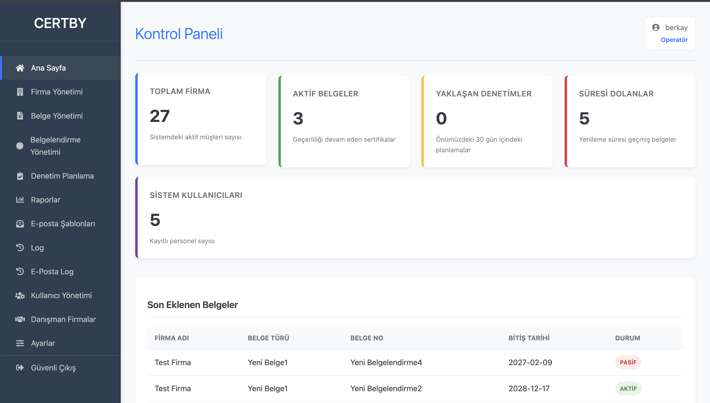

# CertBy - Document & Certification Tracking System

CertBy is a web-based management system developed to manage document tracking, certification management, and audit processes for companies. It features role-based access control, automated email notifications, and dynamic reporting tools.



## Features

- Role-Based Access Control (RBAC): Distinct panels and permissions for Operators and Standard Users.
- Certification Management: Tracking of certification validity periods with expiration alerts.
- Dynamic SMTP Configuration: Manageable email settings directly from the dashboard.
- Email Notifications: Automated system notifications and manual email dispatch capabilities.
- Secure Architecture: Built with PHP PDO for secure database interactions and robust session management.
- Reporting & Auditing: Detailed reporting interfaces for audit trails and document statuses.
- Activity Logging: Comprehensive logging of user actions and system changes.

## Tech Stack

- Backend: PHP 8.x
- Database: MariaDB / MySQL
- Frontend: HTML5, CSS3, JavaScript (jQuery)
- Server: Ubuntu / Apache2

## Installation

Follow these steps to set up the project on your local machine:

1. Clone the Repository:
   ```bash
   git clone [https://github.com/berkay-karakus/CertBy.git](https://github.com/berkay-karakus/CertBy.git)

2. Database Configuration
   Rename db-example.php to db.php.
   Open db.php and update it with your local database credentials.

3. Import Database
   Import the database.sql file into your local MySQL server.

4. Dependencies
   If composer.json is present, run:
   composer.install

   